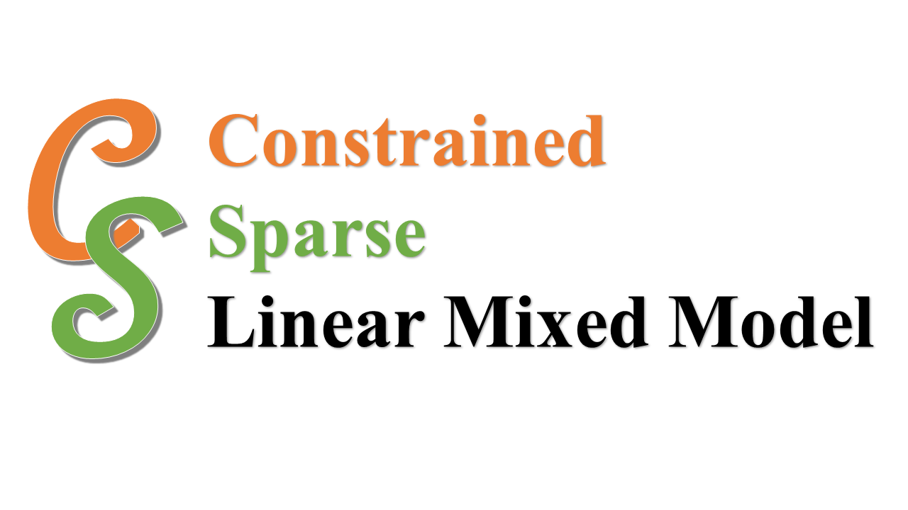

# CS-LMM (Constrained Sparse multi-locus Linear Mixed Model)

Implementation of CS-LMM in this paper:

Wang H, Vanyukov MM, Xing EP, and Wu W. Discovering Genetic Variants with Weak Associations Guided by Known Variants (_under review_)

## Introduction

CS-LMM is used to detect the weaker genetic association conditioned on the stronger validated associations.

## File Structure:

* [models/](https://github.com/HaohanWang/CS-LMM/tree/master/models) main method for CS-LMM
* [utility/](https://github.com/HaohanWang/CS-LMM/tree/master/utility) other helper files
* [cslmm.py](https://github.com/HaohanWang/CS-LMM/blob/master/cslmm.py) main entry point of using CS-LMM to work with your own data

## An Example Command:

```
python cslmm.py -n data/mice.plink
```
#### Instructions
```
  Options:
  -h, --help          show this help message and exit

  Data Options:
    -t FILETYPE       choices of input file type
    -n FILENAME       name of the input file
    -v FILEVALIDATED  list of the validated markers

  Model Options:
    --lambda=LMBD     the weight of the penalizer. If neither lambda or snum
                      is given, cross validation will be run.
    --snum=SNUM       the number of targeted variables the model selects. If
                      neither lambda or snum is given, cross validation will
                      be run.
    -s                Stability selection
    -q                Run in quiet mode
    -m                Run without missing genotype imputation
```
#### Data Support
* CS-LMM currently supports CSV and binary PLINK files.
* Extensions to other data format can be easily implemented through `FileReader` in `utility/dataLoadear`. Feel free to contact us for the support of other data format.

## Python Users
Proficient python users can directly call the CMM method with python code, see example starting at [Line 107](https://github.com/HaohanWang/CS-LMM/blob/master/cslmm.py#L107)

## Installation (Not Required)
You will need to have numpy, scipy and pysnptool installed on your current system.
You can install CS-LMM using pip by doing the following

```
   pip install git+https://github.com/HaohanWang/CS-LMM
```

You can also clone the repository and do a manual install.
```
   git clone https://github.com/HaohanWang/CS-LMM
   python setup.py install
```

## Contact
[Haohan Wang](http://www.cs.cmu.edu/~haohanw/)
&middot;
[@HaohanWang](https://twitter.com/HaohanWang)
